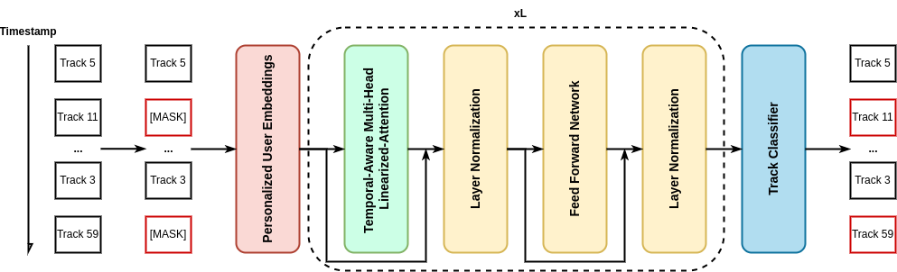
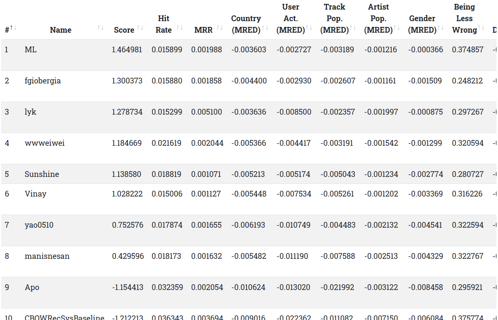

# RecFormer: Personalized Temporal-Aware Transformer for Fair Music Recommendation
Official code of the paper RecFormer: Personalized Temporal-Aware Transformer for Fair Music Recommendation (evalRS @ CIKM 2022). 
We won the seventh prize in this challenge.
Paper will be released soon.

## Overview
The shared task, a Rounded Evaluation of Recommender Systems ([EvalRS @ CIKM 2022](https://github.com/RecList/evalRS-CIKM-2022)), is introduced to broadly measure multifaceted model predictions for music recommendation.
To tackle the problem, we propose the RecFormer architecture with a personalized temporal-aware transformer to model the interactions among user history in a single framework.
Specifically, RecFormer adopts a masked language modeling task as the training objective, which enables the model to capture fine-grained track embeddings by reconstructing tracks.
Meanwhile, it also integrates a temporal-aware self-attention mechanism into the Transformer architecture so that the model is able to consider time-variant information among different users.
Moreover, we introduce linearized attention to reduce quadratic computation and memory cost since the limited time is one of the challenges in this task.
## Setup
- As this challenge is tested on Amazon Deep Learning AMI, this step is optional and may be an unexpected error since we failed to have a quota to run on the machine.
    - Launch an Amazon Deep Learning AMI Pytorch image.
    - Note: Please make sure the image can run PyTorch 1.10.
- Run the following command to install the corresponding packages.
    ```=script
    conda env create -f environment.yml
    ```
- Clone submodule of evalRS-CIKM-2022
    ```=script
    git submodule init 
    git submodule update
    ```
- Replace the `evalRS-CIKM-2022/submission.py` with the modified `submission.py`.
    ```=script
    cp submission.py evalRS-CIKM-2022/submission.py
    ```
    - Note: The only change is in [here](https://github.com/wywyWang/RecFormer/blob/main/EvalRSRecList.py#:~:text=%40rec_test(%27MRED_MOST_DOH%27)), so you can copy this function directly as well.
- Place your `upload.env` in the root folder.

## Usage
- Run the end-to-end pipeline (please make sure the environment has been activated).
    ```=script
    cd evalRS-CIKM-2022
    python submission.py
    ```
- Test the model with the proposed metric *MRED_DOH* (optional).
    - Replace the `evalRS-CIKM-2022/evaluation/EvalRSRecList.py` with `EvalRSRecList.py`.
        ```
        cp EvalRSRecList.py evalRS-CIKM-2022/evaluation/EvalRSRecList.py
        ```
    - Rerun `submission.py` and the MRED_DOH will report in the terminal.

## Method Overview
<div align="left">

</div>

## Leaderboard Screenshot
<div align="left">

</div>
